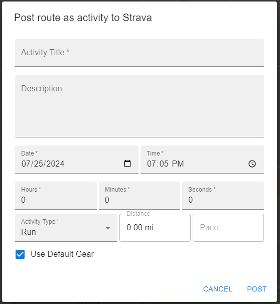

### HowFar is an activity mapping app that makes mapping runs, hikes, bikes and more a quick and easy process.

## Key Features
- No login required! You don't need to make an account to use HowFar. I don't want your data and I know how annoying it is to be forced to create an account to do something simple like map a run. The only time you will need to login to anything is to post a mapped activity to Strava (more on that later).
- All the mapping features you've come to expect from the other activity mapping tools on the internet. Auto follow roads, edit, undo functionality, clear route, out and back, multiple map views (street, satellite, trails, dark), etc.
- Right click to quickly bypass the auto follow roads feature for smooth transition between following established routes and (for example) hopping curbs, mapping through parks, etc.
- Append route segments to both the beginning and end of the route. Helpful in case you've mapped a complex route and want to edit the start.
- Road/walkway preference for fine-tuning routes.
- Strava integration to post your route as an activity to your Strava account (requires Strava login).

## Selected Features Explained
### Mapping Functionality
Create a route by clicking on the map. As you click, the most efficient route between your selected points will be calculated and automatically drawn onto the map. Turn off "Auto Follow Roads" or right click at any time to route a straight line between your points instead. This is useful when your route does not follow established roads or paths, for example when it goes through an open field, off trail in the wilderness, or hops a curb from a road to a path.

|  |
|:-:|
| *Auto follow roads routing* |

|  |
|:-:|
| *Straight line routing* |

As you map, your routes distance and estimated elevation gain and loss are updated and displayed at the top of the side bar. Adding, moving or deleting points will update these values, and clearing your route will reset all values to 0.

__Note: Distances are very accurate, but elevation gain and loss are rough estimates and should not be trusted for official use__

|  |
|:-:|
| *Displayed distance and estimated elevation change* |

### Add Waypoints in Line Segments
Enabling the "Edit lines on click" will allow you to edit existing line segments within your route. When disabled (which is the default) clicking on a part of your route will simply add a new waypoint to the end of beginning of the route (depending on the "Add new points to beginning/end" option). But when this setting is enabled, hovering the mouse over a line will reveal a gray "add new" waypoint. Clicking on the line will add a waypoint at that point in the middle of the line, allowing it to be dragged/edited.

|  |
|:-:|
| *Hovering the mouse over a line reveals the "add new waypoint in line" marker. Click to add a new waypoint at that point on your route and split the line in two* |

|  |
|:-:|
| *After the point has been added, it can be moved, editing that section of your route in place* |

###  Map Types
HowFar has multiple map types.

|  |
|:-:|
| *Standard streets view map* |

|  |
|:-:|
| *Outdoors map. Recommended for mapping trail runs, hikes and mountain bike rides as it makes viewing trails a much nicer experience* |

|  |
|:-:|
| *Satellite map* |

|  |
|:-:|
| *Dark theme map* |

### Post to Strava
Clicking into the menu at the top left of the sidebar brings connection and display settings. The first two buttons in the sidebar are "Connect with Strava" and "Post Activity". Before an activity can be posted to Strava, you must first connect using the "Connect with Strava" button. This will bring up a Strava controlled login window. Note that HowFar never sees and does not save your login info, but it does save a token safely in the browser which will prevent you from having to re-login to Strava every time you open the app. The token lasts 6 months and can be deleted by clearing your cookies.

Underneath the "Connect with Strava" button you will see your connection status. If you are connected, you will see a green check. This indicates that you have already logged in and are able to post your activity. If you see a red X, you will need to login.

The "Post Activity" button will bring up a window where you can enter information like a name, description, elapsed time, time of day and activity type. Enter all of the required fields and click "Post" to post your run to Strava.

|  |
|:-:|
| *Connect with Strava and Post Activity buttons* |

|  |
|:-:|
| *Post activity to strava dialog window* |

### Favored Surface Type Slider
This can be a confusing feature, but can also be helpful for mapping different types of activities, or for mapping in certain geographic areas. Basically, the closer the slider is to favoring "Roads", the more weight the mapping service will put on keeping your route **ON** roads. The closer the slider is to favoring "Walkways", the more weight the mapping service will put on keeping you **OFF** of roads and on sidewalks, trails, path and walkways.

|  |
|:-:|
| *Favored surface type slider* |

|  |
|:-:|
| *Routing with the slider all the way toward "Walkways". The route avoids roads and stays on paths* |

|  |
|:-:|
| *Routing with the slider all the way toward "Roads". The route avoids paths and stays on roads* |
